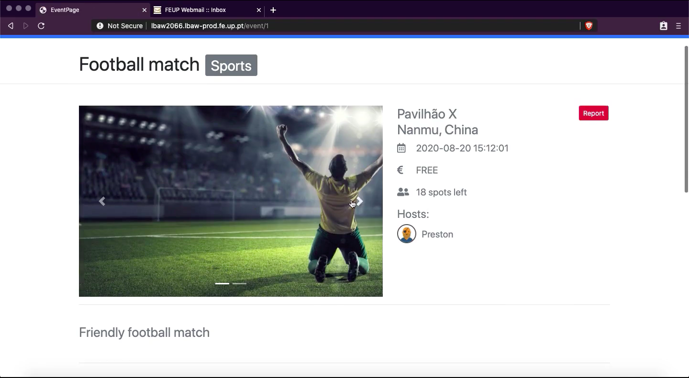

# A10: Presentation

The purpose of this project was to develop a web application for an event management platform.

The goal of this artefact is to promote, present and demonstrate the product developed.

## 1. Product presentation

Meethology is an event management web application for people who want to create events or participate in others.
The user is able to search for events using the website filters, invite other people through email, purchase tickets and create their own events.

Each event page has a description with all the information needed, it's own comment section, list of participants and photos of the event.
The administrator is able to promote other users to admin position, ban users and remove commentaries and events by evaluating the reports.

The product can be found at: http://lbaw2066.lbaw-prod.fe.up.pt

## 2. Video presentation

The video can be found at: https://drive.google.com/open?id=1geGzpl4LEq4NyA9vfDmkJy_G52CuJVqV

## 3. Contacts

* André Mamprin Mori, up201700493@fe.up.pt
* Carlos Miguel Guerra Soeiro, up201706405@fe.up.pt
* Gustavo Speranzini Tosi Tavares, up201700129@fe.up.pt

# Annex A: Group Self-Evaluation

All group members have worked in all the components.

The individual contribution of each member to the LBAW project, and considering all artefacts, is expressed in the following list:

* André Mamprin Mori, _contribution level_ [A]
* Carlos Miguel Guerra Soeiro, _contribution level_ [C]
* Gustavo Speranzini Tosi Tavares,  _contribution level_ [C]

***
GROUP2066, 07/06/2020
 
* André Mamprin Mori, up201700493@fe.up.pt (editor)
* Carlos Miguel Guerra Soeiro, up201706405@fe.up.pt
* Gustavo Speranzini Tosi Tavares, up201700129@fe.up.pt
