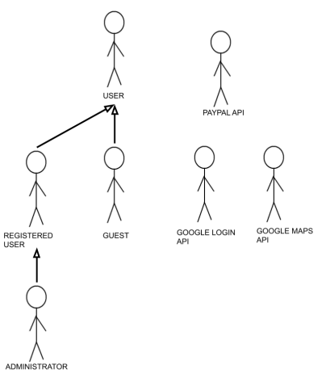


# A2: Actors and User stories

**Meethology** is an event managing platform that users can create and join events based on their interests.

This artefact specifies the content of the actors and user stories of the project.

## 1. Actors

The actors for **Meethology** are represented in Figure 1 and described in the tables below.

> Figure 1: Actors

| Identifier | Description | Examples |
| - | - | - |
| User   | Generic user that can only search and view events.  | n/a  |
| Registered User  | Authenticated  user that can create and join events.   | n/a  |
| Guest  | Non authenticated user that can create an account or authenticate. | n/a  |
| Administrator | Authenticated user that is responsible for managing and moderating users and events. | n/a  |
| Google Login API | External API used for user registration or authentication.  | Google Login |
| Google Maps API  | External API used for location services.  | Google Maps  |
| PayPal API  | External API used for payment.  | PayPal  |
> Table 1: Description of the Actors

## 2. User Stories

The user stories for the actors are presented in the following tables.

### 2.1. User

| Identifier | Name | Priority | Description |
| - | - | - | - |
| US0.1 | Search Events | High  | As a _User_, I want to search events, so that I can find events that interest me. |
| US0.2 | See Homepage  | High  | As a _User_, I want to access the homepage, so that I can see the main features of the website.  |
| US0.3 | See About   | Medium  | As a _User_, I want to access the About page, so that I can get more information about the platform.  |
| US0.4 | See FAQ  | Medium  | As a _User_, I want to access the FAQ page, so that I can see the Frequently Asked Questions.  |
| US0.5 | See Contact | Medium  | As a _User_, I want to access the Contacts page, so that I can contact an employee that can help me.  |
| US0.6 | Search Events with filters | Medium  | As a _User_, I want to search for events using filters, so that I can find an event with specific filters. |
| US0.7 | See address in Google Maps | Low   | As a _User_, I want to see the address of the event on Google Maps, so that I can know the exact location of the event. |
> Table 2: User stories of _User_

### 2.2. Registered User

| Identifier | Name | Priority | Description  |
| - | - | - | - |
| US1.1 | Log Out  | High  | As a _Registered User_, I want to log out of the system, so that I can end my session.   |
| US1.2 | Create Event  | High  | As a _Registered User_, I want to create an event, so that I can host my own event. |
| US1.3 | Join Event  | High  | As a _Registered User_, I want to join an event, so that I can attend it. |
| US1.4 | Edit Event  | High  | As a _Registered User_, I want to edit my events, so that I can keep it up to date. |
| US1.5 | View Profile  | High  | As a _Registered User_, I want to view my profile, so that I can see my personal information. |
| US1.6 | Edit Profile  | High  | As a _Registered User_, I want to edit my profile, so that I can change my personal information.   |
| US1.7 | Comment  | Medium   | As a _Registered User_, I want to comment on events, so that I can make suggestions or ask questions about the event.  |
| US1.8 | Rate   | Medium   | As a _Registered User_, I want I want to rate other user's events, so that I can share my opinion about it.   |
| US1.9 | Invite | Medium   | As a _Registered User_, I want to invite people to an event, so that I can call my friends.   |
| US1.10  | Payment using External API | Medium   | As a _Registered User_, I want to buy a ticket to an event using my PayPal account, so that I can participate in the event. |
| US1.11  | Report Comment   | Medium   | As a _Registered User_, I want to report a comment, so that I report inappropriate comments.  |
| US1.12  | Report Event  | Medium   | As a _Registered User_, I want to report an event, so that I report inappropriate events.  |
| US1.13  | View joined events | Medium   | As a _Registered User_, I want to view my joined events, so that I can see my past and future joined events. |
| US1.14  | Recover Password | Medium   | As a _Registered User_, I want to my password if I forget it. |
| US1.15  | View Statistics  | Low | As a _Registered User_, I want to view statistics about an event, so that I can have better knowledge about it.   |
| US1.16  | View Participants  | Low | As a _Registered User_, I want to view the participants of an event, so that I can know who is participating in it.   |
> Table 3: User stories of _Registered User_

### 2.3. Guest
| Identifier | Name | Priority | Description |
| - | - | - | - |
| US2.1 | Register  | High  | As a _Guest_, I want to create an account, so that I can authenticate myself. |
| US2.2 | Log in  | High  | As a _Guest_, I want to authenticate myself, so that I can create or join an event.   |
| US2.3 | Register using External API | Low   | As a _Guest_, I want to create an account by linking my Google Account, so that I can authenticate myself.  |
| US2.4 | Log in using External API   | Low   | As a _Guest_, I want to authenticate myself by using my Google Account, so that I can create or join an event. |
> Table 4: User stories of _Guest_

### 2.4. Administrator
| Identifier | Name | Priority | Description |
| - | - | - | - |
| US3.1 | Delete Event | High  | As an _Administrator_, I want to delete an event, so that I can remove inappropriate events.   |
| US3.2 | Delete comments   | High  | As an _Administrator_, I want to delete comments, so that I can remove inappropriate events.   |
| US3.3 | Delete User  | High  | As an _Administrator_, I want to delete a user, so that I can remove users that have been banned more than once and still have inappropriate conduct.  |
| US3.4 | Ban User  | Medium  | As an _Administrator_, I want to ban a user, so that I can block users with inappropriate conduct.  |
| US3.5 | Unban User   | Medium   | As an _Administrator_, I want to unban a user, so that he can access his account again.   |
| US3.6 | Promote User | Medium   | As an _Administrator_, I want to promote a user, so that I can give him administrator rights.  |
| US3.7 | Demote User | Medium   | As an _Administrator_, I want to demote a user, so that I can remove his administrator rights.  |
| US3.8 | View reported comments | Medium   | As an _Administrator_, I want to view reported comments, so that I can find and judge reported comments. |
| US3.9 | View reported events   | Medium   | As an _Administrator_, I want to view reported events, so that I can find and judge reported events.  |
> Table 5: User stories of _Administrator_

## 3. Annex: Supplementary requirements  

The annex contains the Business Rules, Technical Requirements and Restrictions for the system.

### 3.1. Business rules

A business rule defines mandatory actions the website needs to follow to function properly.

| Identifier | Name | Description |
| - | - | - |
| BR01  | Rate Own Event | A _Registered User_ is not authorized to rate his own event. |
| BR02  | Event Date  | All the events must be in a future date when created and the ending date must be after the start date. |
| BR03  | Deleted User | When a user is deleted, all his personal information and future events are deleted from the website. |
| BR04  | Banned User | Future events from the user are deleted when he is banned.  |
> Table 6: Business Rules specifications.

### 3.2. Technical requirements

Technical requirements are the necessary aspects the platform needs to operate.

| Identifier | Name | Description |
| - | - | - |
| TR01  | Reliability | The website must be able to handle errors while being used. |
| TR02  | Security  | All the data from users and events must be protected from unauthorised users through a verification system. |
| TR03  | Usability | The website must be easy for users to navigate through without having too much information being displayed. |
> Table 7: Technical requirements specifications.

### 3.3. Restrictions

A restriction limits the freedom of how the platform is developed.

| Identifier | Name | Description |
| - | - | - |
| C01 | Deadline | The platform should be able to use before the end of the semester. |
> Table 8: Restrictions specifications.

## Revision history

**24/02/2020** - First Version

**23/03/2020** - Changed some User Stories priorities.

***
GROUP2066 24/02/2020

*  André Mamprin Mori, up201700493@fe.up.pt
*  Carlos Miguel Guerra Soeiro, up201706405@fe.up.pt (editor)
*  Gustavo Speranzini Tosi Tavares, up201700129@fe.up.pt
