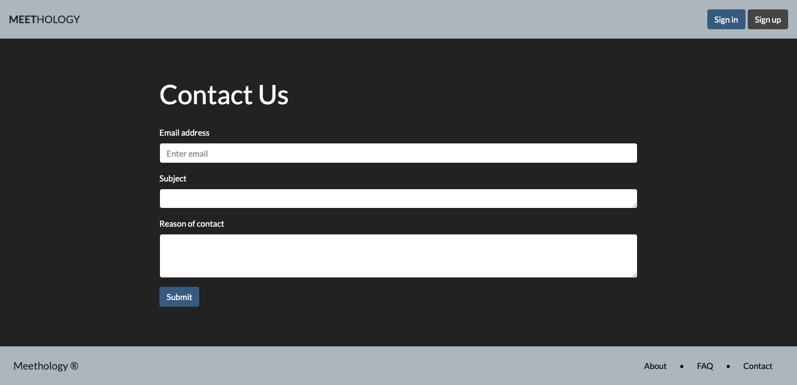
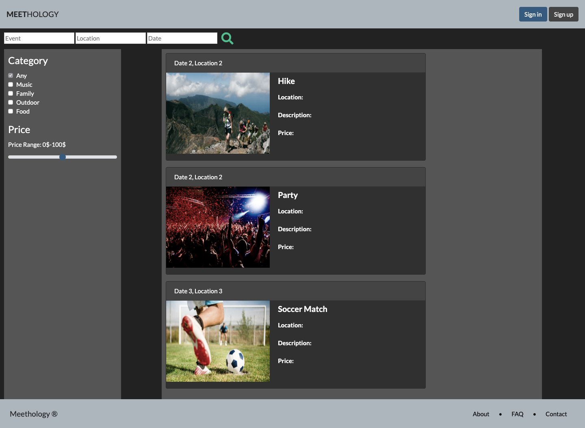
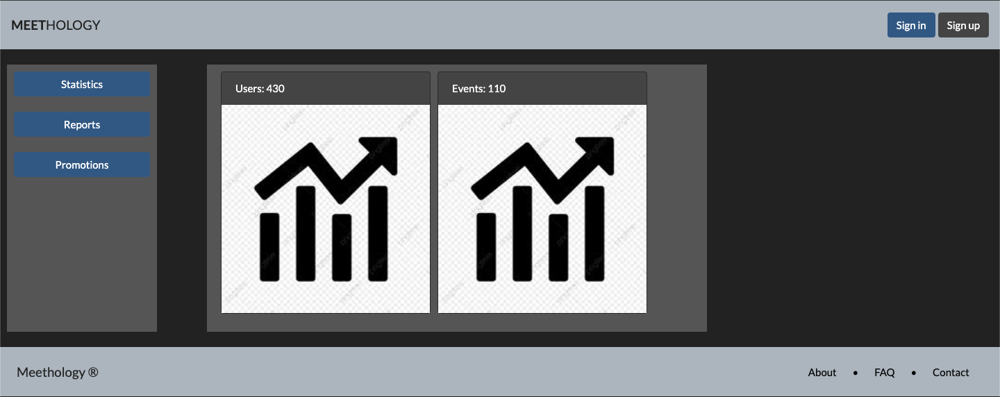
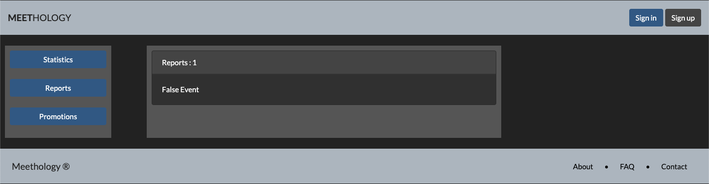
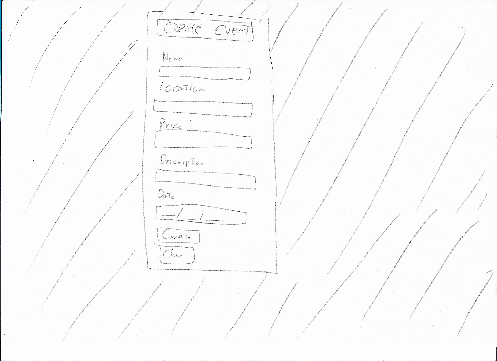

# A3: User Interface Prototype

**Meethology** is an event managing platform that users can create and join events based on their interests.

This artefact includes an overview of the user interface and features common to all pages, an overview about the *Sitemap* and a description of the main interactions with the web application. Each interface is described at the end of the artefact.

## 1. Interface and common features

**Meethology** is based on HTML5, PHP, CSS and JavaScript. Bootstrap framework was used to simplify the implementation of the User Interface.

###### Figure 1: Interface's guidelines

1. Product name
2. Navbar
3. Main content
4. Footer

## 2. Sitemap

A *Sitemap* is used to visually represent the relationship between all the pages of a website, giving an idea of how the website is going to be structured.

###### Figure 2: Sitemap

## 3. Storyboards

*Storyboards* represent the user's main interactions with the system.

###### Figure 3: Storyboard centered on showing how to access the user profile.

###### Figure 4: Storyboard centered on showing how to join an event.

###### Figure 5: Storyboard centered on showing how to invite someone to your own event, showing how to create it as well.

## 4. Interfaces

### UI01: Home

Main website page with search bar and main events nearby.

###### Figure 6: [Home](../src/pages/index.php)

### UI02: About

Page with information about the platform and its creators.

###### Figure 5: [About](../src/pages/about.php)

### UI03: Contact

Page with the platform's contact information.

###### Figure 7: [Contact](../src/pages/contact.php)

### UI04: FAQ

Page with the Frequently Asked Questions.

###### Figure 8: [FAQ](../src/pages/faq.php)

### UI05: Search Results

Page with results of the user's search, with filters by the side.

###### Figure 9: [Search Results](../src/pages/searchEvent.php)

### UI06: Event Page

Page of an event with information.

###### Figure 10: [Event](../src/pages/eventC.php)

### UI07: User Profile Page

Page of an event with information.

###### Figure 11: [User Profile](../src/pages/profile.php)

### UI08: Sign In Popup

Pop Up with sign in.

###### Figure 12: [Sign In](../src/pages/index.php)

### UI09: Sign Up Popup

Pop Up with sign up.

###### Figure 13: [Sign Up](../src/pages/index.php)

## UI10: Admin Stats

Stats about application.

> Figure 26: Admin Stats

## UI11: Admin Reports

Reports by users.

> Figure 27: Admin Reports

## UI12: Admin Promotion page

Promote a user to administrator.

> Figure 28: Admin Promotion page

## UI13: Event Creation page

Page where registered user can create an event.

> Figure 29: Event Creation page

## UI14: Profile edition page

Page where registered user can edit personal information.

> Figure 29: Profile edition page

## A1. Annexes

> Figure 14: Homepage

> Figure 15: Login

> Figure 16: SignUp

> Figure 17: Profile

> Figure 18: SearchPage

> Figure 19: EventPageGuest

> Figure 20: EventPageOwner

> Figure 21: EditEvent

> Figure 22: CreateEvent

> Figure 23: FAQ

> Figure 24: Contact

> Figure 25: About

## Revision history

**09/03/2020** - First Version

**23/03/2020** - The main user interaction features are now included, Essential User Stories are supported, Storyboards are more perceptible, all individual pages are included and Admin pages are now created.

***
GROUP2066 09/03/2020

*  André Mamprin Mori, up201700493@fe.up.pt
*  Carlos Miguel Guerra Soeiro, up201706405@fe.up.pt
*  Gustavo Speranzini Tosi Tavares, up201700129@fe.up.pt (editor)
