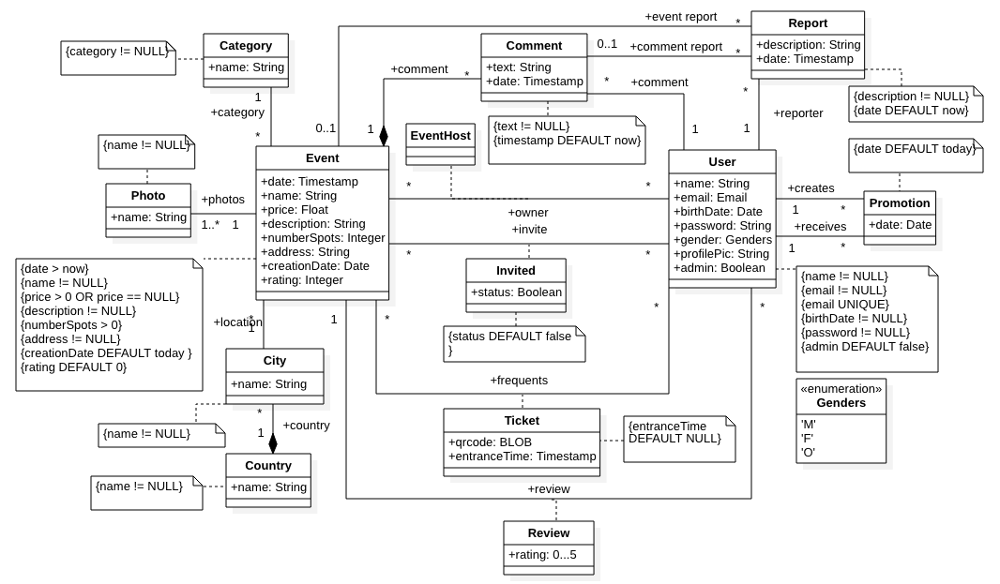

# A4: Conceptual Data Model

**Meethology** is an event managing platform that users can create and join events based on their interests.

This artefact contains the UML class diagram that presents the main entities, with their attributes and constraints, and the relationships between them.

## 1. Class diagram

###### Figure 1: UML Class Diagram

## 2. Additional Business Rules

| Identifier | Name            | Description                                       |
| ---------- | --------------- | ------------------------------------------------- |
| BR01       | Rating          | A user can only rate an event if he participated. |
| BR02       | Event Photo     | An event must have at least one photo.            |
| BR03       | Event Address   | An event must have a valid address.               |
| BR04       | Add Event Photo | Only a host can add a photo in the event.         |

###### Table 1: Business Rules

## Revision history

**16/03/2020** - First Version

**24/03/2020** - Updated UML diagram adding Genders enum, Invite association class, Promotion class and Location class was split into 2 different classes.

**26/03/2020** - Added an addition business rule.

**12/04/2020** - Added new table Report to UML.

***
GROUP2066 16/03/2020

*  André Mamprin Mori, up201700493@fe.up.pt
*  Carlos Miguel Guerra Soeiro, up201706405@fe.up.pt
*  Gustavo Speranzini Tosi Tavares, up201700129@fe.up.pt
